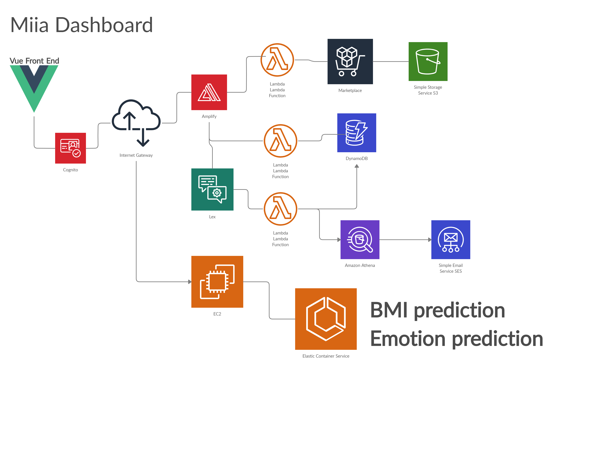

# miiadashboard


<table>
  <tr>
   <td valign="top"></td>
  </tr>
  <tr>
    <td>Login Screen </td>
     <td>Main Dashboard</td>
     <td>User Profile</td>
	 
  </tr>
  <tr>
    <td valign="top"></td>
    <td valign="top"></td>
    <td valign="top"></td>
    
  </tr>
 </table>
<table>
  <tr>
	 <td>Vitals Lex Bot</td>
	 <td>Search Provider Lex Bot</td>
	 <td>Sample Email search</td>
	 
  </tr>
  <tr>
    <td valign="top"></td>
    <td valign="top"></td>
    <td valign="top"></td>
  </tr>
 </table>

## Project setup
```
npm install
```

### Compiles and hot-reloads for development
```
npm run serve
```

### Compiles and minifies for production
```
npm run build
```

### Lints and fixes files
```
npm run lint
```

### Customize configuration
See [Configuration Reference](https://cli.vuejs.org/config/).
