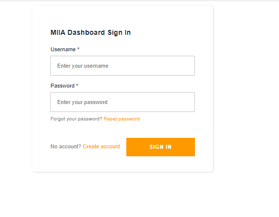
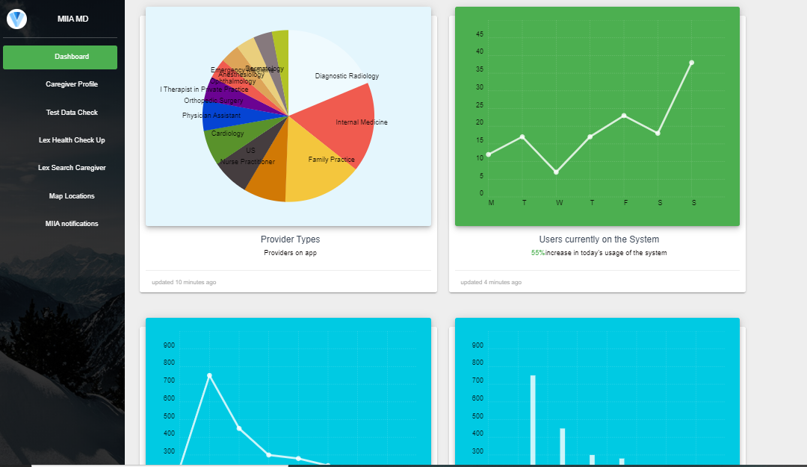
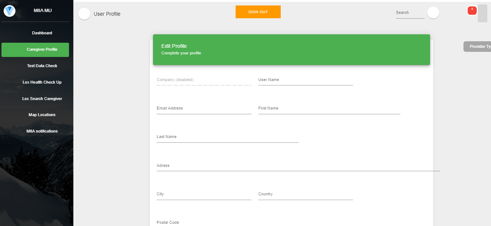
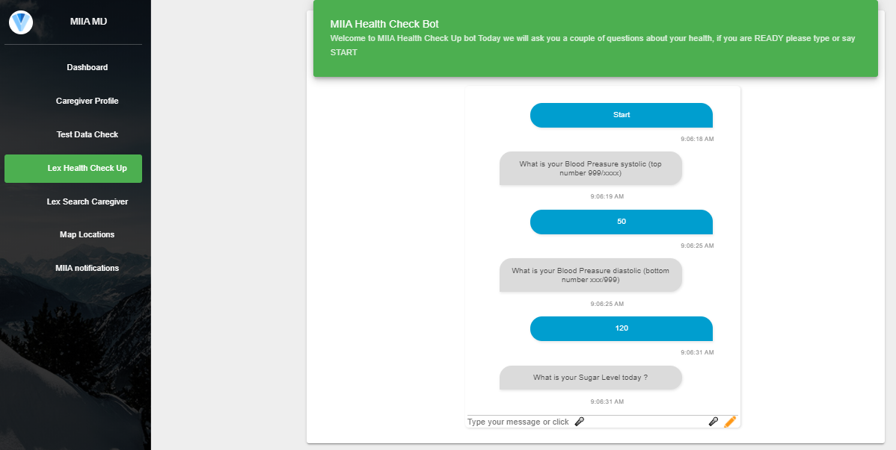
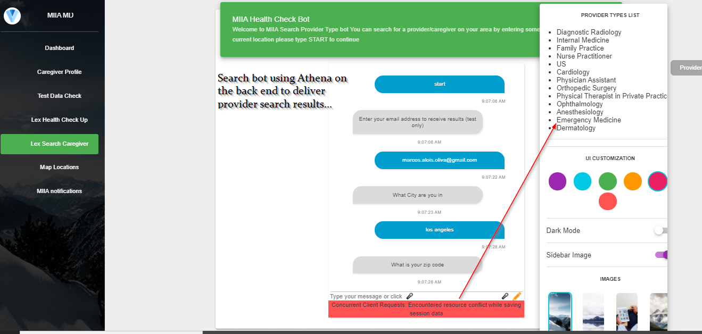
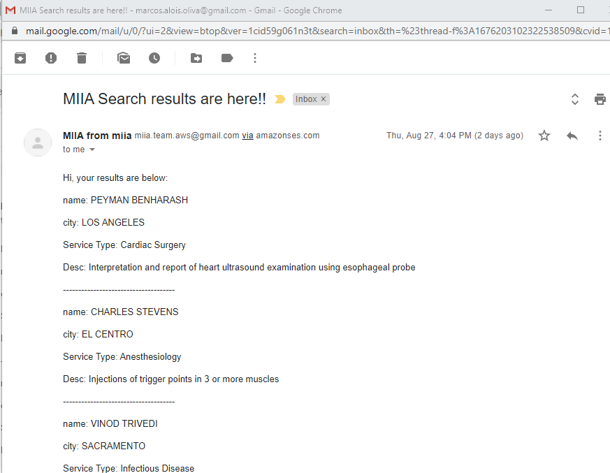
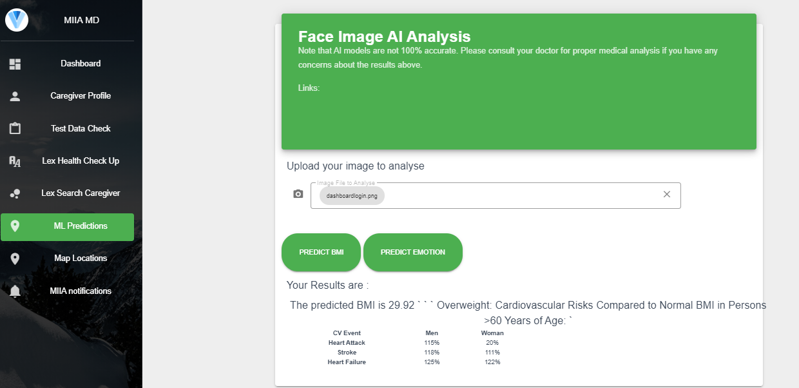
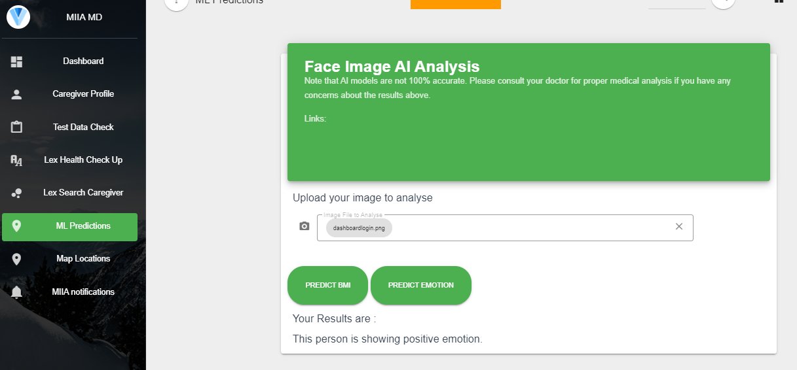

# miiadashboard

<table>
  <tr>
   <td colspan="3" valign="top"></td>
  </tr>
  <tr>
    <td>Login Screen </td>
     <td>Main Dashboard</td>
     <td>User Profile</td>
	 
  </tr>
  <tr>
    <td valign="top"></td>
    <td valign="top"></td>
    <td valign="top"></td>
    
  </tr>
 </table>
<table>
  <tr>
	 <td>Vitals Lex Bot</td>
	 <td>Search Provider Lex Bot</td>
	 <td>Sample Email search</td>
	 
  </tr>
  <tr>
    <td valign="top"></td>
    <td valign="top"></td>
    <td valign="top"></td>
  </tr>
  <tr>
	 <td>BMI Prediction</td>
	 <td>Emotion Prediction</td>
	 <td></td>
	 
  </tr>
  <tr>
    <td valign="top"></td>
    <td valign="top"></td>
    <td valign="top"></td>
  </tr>
 </table>

## AWS Hackathon testing

```
You can use the following URL to test the application
by signing up and create a new user

https://master.d3s7eipwj38e3u.amplifyapp.com/

```
